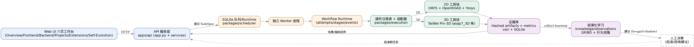
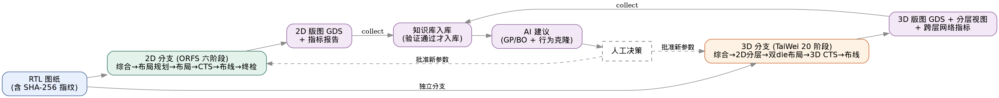
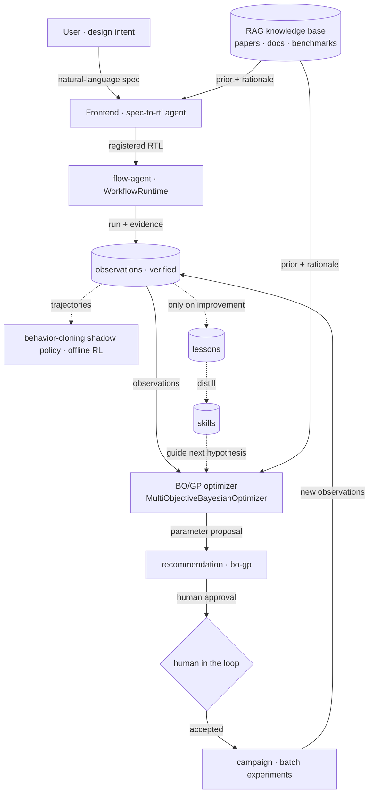
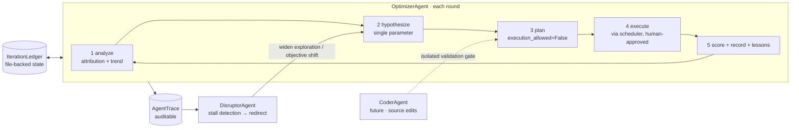

# OpenROAD Self-Evolving EDA Platform

> **English** · [中文](README.zh-CN.md)

An open platform for chip-design automation: 2D / 3D physical design with an AI self-evolution loop.

---

## What is this

Turning chip design from a manual flow into an **automated + self-learning** open platform:

- **Automated flow**: input RTL, automatically complete 2D / 3D physical design (synthesis → floorplan → placement → routing → GDS), with full traceable evidence.
- **Self-learning**: every successful run is collected into the knowledge base; AI reviews history and recommends next-step parameters (self-evolution loop).
- **Open extension**: plugin architecture — a new EDA tool only needs an adapter following the interface; plugins never interfere with each other.

**In one sentence: RTL goes in, GDS comes out, experience is kept, and the platform gets smarter.**

---

## Architecture



*Overall: web workspace → API service → SQLite queue → worker → workflow runtime + plugin registry → 2D / 3D toolchains → evidence base → self-evolution → AI suggestions → human decision.*



*Input RTL (SHA-256 fingerprinted) → two branches: 2D (ORFS 6 stages) and 3D (TaiWei 20 stages) → GDS + metrics → knowledge base (verified runs only) → AI suggestions (GP/BO + behavior cloning) → human approval.*

### Agent architecture (self-evolution)



### Evolve-agent loop (Optimizer → Disruptor → Coder)



---

## Feature Status

| Feature | Status | Notes |
| --- | --- | --- |
| 2D physical design (ORFS 6-stage) | ✅ Working | Nangate45 RTL→GDS verified end-to-end |
| 3D physical design (TaiWei) | ✅ Working | 3 platforms × any design; 3 real variants verified |
| Web workspace | ✅ Available | Overview / Frontend / Backend / Projects / Self-Evolution / Tutorial |
| Natural-language RTL generation | ✅ Available | Spec-to-RTL via server codex model, human review before registration |
| Frontend LLM entry | ✅ Available | Three entry buttons (upload / LLM spec / examples), agent run trace dashboard |
| Agent architecture | ✅ Working | OptimizerAgent loop (analyze→hypothesize→plan→score→record) + Disruptor + Coder interface |
| Self-evolution (knowledge + AI suggestions) | ✅ Working | Verified collection only; GP/BO + behavior cloning + lessons/skills + feedback loop |
| Lessons & skills | ✅ Working | Improvement-only distillation; context-scoped retrieval; planning-side skill application |
| Agent trace dashboard | ✅ Working | Every LLM/agent operation traced; step durations & metric comparison |
| Plugin ecosystem | ✅ Ready | TaiWei / RTLScout / AgenticPD / EDACraft / ImplCraft / DPLEvolve |
| Batch experiments (Campaign / Agent search) | ✅ Working | 12 campaigns / 68 members executed; reviewable plans, human-confirmed |
| No-auth internal mode | ✅ Available | `OPENROAD_PLATFORM_NO_AUTH=1` skips registration |
| LLM online optimization | 🚧 Needs config | BYOK or shared model; credentials in memory only |

> Full capability map: Overview page + [Tutorial 01](docs/tutorials/01_openroad_platform_overview.md).

---

## Repository Layout

```text
openroad-platform/
├── apps/
│   ├── api/                 # Backend: HTTP API, design/task/learning services
│   └── web/                 # Frontend web workspace (bilingual)
├── packages/
│   ├── contracts/           # Data contracts: TaskSpec / PluginManifest / artifact rules
│   ├── scheduler/           # Scheduling: SQLite queue, Runtime, worker, campaigns
│   ├── execution/           # Execution: plugin registry, 2D/3D adapters, process isolation
│   ├── analysis/            # Analysis + learning: metrics, knowledge, GP/BO, suggestions
│   └── visualization/       # Visualization: Graphviz, KLayout, 3D views
├── integrations/            # Plugin manifests and pinned source audits
├── workflows/               # Standard flow guides (spec-to-gds / three_d / ...)
├── scripts/                 # Launch, worker, acceptance, toolchain build
├── tests/                   # Automated tests (pytest)
├── docs/                    # Docs: architecture, HTML tutorials, operations, plugins
├── knowledge/               # Public knowledge corpus
├── project_kb/              # Technical decisions and lessons
├── var/                     # Runtime evidence (git-ignored, do not delete)
└── .tools/  .external-src/  # Local toolchains / pinned third-party sources (ignored)
```

---

## Development Model

- **Parallel plugin development**: each plugin is an independent `xxx_plugin.py` +
  `xxx_adapter.py` pair with zero cross-dependencies. A new plugin needs ① its own
  file pair, ② an export in `execution/__init__.py`, ③ a manifest mount in `app.py`.
  Developers of different plugins never conflict.
- **Branch flow**: feature branch → commit → full test suite → merge to main.
- **Testing**: `python3 -m pytest -q` (currently 233 passed).

> Plugin guide: [docs/PLUGINS.md](docs/PLUGINS.md) · [CONTRIBUTING.md](CONTRIBUTING.md)

---

## API & Plugins

REST API (every web feature is callable via API):

| Endpoint | Purpose |
| --- | --- |
| `/api/auth/*` | Login / register (skippable in no-auth mode) |
| `/api/designs/*` | Design registration / import / generation |
| `/api/runtime/runs/*` | 2D/3D task submit, progress, cancel, artifacts |
| `/api/agent/iterate` | Run one OptimizerAgent loop (planning-only, human review) |
| `/api/agent/traces` | Agent run traces (every LLM/agent operation, auditable) |
| `/api/extensions/taiwei/run` | 3D task submit (platform / parameters) |
| `/api/extensions/edacraft/*` | Specialist tools (TCAD / SPICE / ...) |
| `/api/platform/results` | Projects and results |
| `/api/runtime/runs/<id>/collect-learning` | Knowledge collection |
| `/api/learning/observations` | List collected knowledge |
| `/api/recommendations/*` | AI suggestions and human decisions |

**Plugin three pieces**: ① `plugin.json` (identity: capabilities/tools/artifact rules)
② `xxx_plugin.py` (TaskSpec builder) ③ `xxx_adapter.py` (runs the tool, collects outputs).
See [docs/PLUGINS.md](docs/PLUGINS.md).

---

## Quick Start

### Same server (no clone needed)

The repo lives at `/share/home/yuanwenjie/openroad-platform` on this cluster (`~` expands to each user's own home directory, so the exact path differs per user — run `echo $HOME` to find yours):

```bash
cd /share/home/yuanwenjie/openroad-platform
HOST=127.0.0.1 PORT=8000 ./scripts/run_demo.sh
# optional internal no-auth mode: export OPENROAD_PLATFORM_NO_AUTH=1 before starting
```

Open `http://127.0.0.1:8000` (remote machine: use SSH tunnel):

```bash
ssh -N -L 8000:127.0.0.1:8000 <user>@<server>
```

### Fresh machine (clone)

```bash
git clone https://github.com/CODA-Team/ChipEvolve.git
cd ChipEvolve
python3 -m pip install -e '.[test,visualization]'
./scripts/run_demo.sh
```

### Run worker and web separately (recommended)

```bash
export PLATFORM_STATE=/tmp/openroad-platform-$UID
mkdir -p "$PLATFORM_STATE"

# Terminal 1: worker
python3 scripts/run_runtime_worker.py \
  --db var/platform.db --orfs-root ../OpenROAD-flow-scripts \
  --runtime-db "$PLATFORM_STATE/runtime.db" --campaign-db "$PLATFORM_STATE/campaign.db"

# Terminal 2: web
python3 apps/api/app.py --host 127.0.0.1 --port 8000 \
  --db var/platform.db --orfs-root ../OpenROAD-flow-scripts \
  --runtime-db "$PLATFORM_STATE/runtime.db" --campaign-db "$PLATFORM_STATE/campaign.db"
```

### 5-minute walkthrough

1. Open the web UI → import an RTL design (or use a built-in example);
2. Backend page → pick design → **Start RTL-to-GDS** (2D);
3. Backend page → TaiWei 3D panel → pick platform/parameters → **Generate 3D**;
4. Projects page → inspect layout, metrics, artifacts;
5. Projects page → **Collect verified run** → knowledge collected → see suggestions in Self-Evolution.

---

## Requirements

| Component | Notes | Details |
| --- | --- | --- |
| System | ARM64 / openEuler 22.03 (verified), Python ≥ 3.9 | — |
| Platform core | **Zero runtime deps**; optional visualization: KLayout(pya)/Graphviz/Matplotlib/NumPy; test: pytest | [docs/ENVIRONMENT_BASELINE.md](docs/ENVIRONMENT_BASELINE.md) |
| 2D toolchain | ORFS + OpenROAD + Yosys (`../OpenROAD-flow-scripts`) | same doc |
| 3D toolchain | TaiWei-specific ORFS-Research/OpenROAD/Yosys (`.tools/taiwei-official-3d`, LD_LIBRARY_PATH configured) | [integrations/taiwei_pin_3d/environment.lock.json](integrations/taiwei_pin_3d/environment.lock.json) |
| Plugin tools | RTLScout: verilator+yosys; AgenticPD: python; DPLEvolve: bash/git/python3 | [docs/PLUGINS.md](docs/PLUGINS.md) |

**Environment management**: `.tools/` isolates toolchains and Python venvs
(per-plugin venv + pinned commits); package paths injected via `PYTHONPATH`;
git ignores `.tools/`, `.external-src/`, `var/` so the repo stays clean.

> Full details: [docs/ENVIRONMENT_BASELINE.md](docs/ENVIRONMENT_BASELINE.md)

---

## Tutorials

| Tutorial | Topic | Link |
| --- | --- | --- |
| Platform overview | positioning, layout, API, collaboration, knowledge | [01_openroad_platform_overview.md](docs/tutorials/01_openroad_platform_overview.md) |
| TaiWei 3D internals | how 3D works, 20 stages, inputs/outputs | [02_taiwei_3d_how_it_works.md](docs/tutorials/02_taiwei_3d_how_it_works.md) |
| Self-evolution deep dive | collection flow, root-cause analysis | [03_self_evolution_issue.md](docs/tutorials/03_self_evolution_issue.md) |
| Collaboration | Git flow, module ownership, adding a plugin | [04_collaboration_guide.md](docs/tutorials/04_collaboration_guide.md) |
| Why self-evolution works | GP/BO, offline RL explained | [05_why_self_evolution.md](docs/tutorials/05_why_self_evolution.md) |
| AI for EDA mapping | Si2 standard data mapping | [06_ai_for_eda_si2_mapping.md](docs/tutorials/06_ai_for_eda_si2_mapping.md) |

> Tutorials are **Markdown** — GitHub renders them natively, so each link opens in the browser directly. No extra setup needed.

---

## More Docs

- [docs/PLUGINS.md](docs/PLUGINS.md) — plugin authoring guide
- [docs/OPERATIONS.md](docs/OPERATIONS.md) — backup / recovery / cancellation / toolchain upgrade
- [docs/self_evolution_report.md](docs/self_evolution_report.md) — self-evolution audit (technical)
- [CONTRIBUTING.md](CONTRIBUTING.md) — contribution checklist
