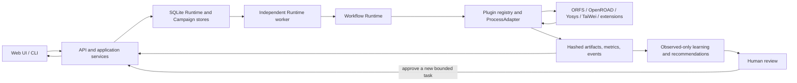

# OpenROAD Self-Evolving EDA Platform

An evidence-first control plane for reproducible digital-design experiments.
The platform turns design intent or RTL into durable 2D/3D implementation
tasks, isolates EDA tools behind versioned adapters, hashes every registered
artifact, and admits only verified observations into its learning loop.

OpenROAD Self-Evolving EDA Platform 是一个“证据优先”的可复现 EDA 控制平面。
平台将设计意图或 RTL 转换为持久化的 2D/3D 实现任务，通过版本化适配器隔离
工具链，对登记产物计算哈希，并且只允许经过验证的运行结果进入自演化闭环。

> Research status: this repository is a local research platform, not a
> sign-off service. A successful run means that the configured open-source
> workflow and its artifact gates passed; it is not a tape-out guarantee.

## Why this platform / 平台定位

The project separates control, execution, evidence, and learning so that an
LLM or UI message can propose work but cannot declare physical-design success.

- **Core flow / 核心流程**: reviewed Spec-to-RTL, registered RTL, durable
  TaskSpecs, six-stage 2D ORFS, independent TaiWei 3D, run comparison, and
  hashed implementation evidence.
- **Extension ecosystem / 扩展生态**: RTLScout, AgenticPD, TaiWei,
  ImplCraft/Tool-Evolve, and EDACraft adapters use the same bounded plugin
  protocol; optional branches do not become dependencies of the core flow.
- **Learning system / 学习系统**: public knowledge and tenant observations are
  kept separate; explicit collection, provenance checks, recommendations, and
  human decisions form an observed-only feedback loop.

核心原则是：模型可以提出候选方案，用户可以批准任务，但 Runtime 和真实工具产物
才是状态、指标和成功结论的权威来源。失败运行和诊断证据不会被成功文案覆盖。

## Product surfaces / 功能界面

The current Web application has five top-level routes. Model-provider settings
are embedded in the Overview and Frontend surfaces rather than presented as a
sixth route.

| Surface | Purpose | 中文说明 |
| --- | --- | --- |
| Overview | Platform health, capability map, tutorial, optional branches | 平台状态、能力地图、教程和可选支线 |
| Frontend Design | Upload/generate RTL, review synthesis and schematics, run bounded RTL exploration | 上传或生成 RTL、查看综合与原理图、运行有界 RTL 探索 |
| Backend Design | Submit 2D ORFS, batch/search plans, or independent TaiWei 3D tasks | 提交 2D ORFS、批量/搜索计划或独立 TaiWei 3D 任务 |
| Projects & Results | Inspect designs, runs, metrics, views, artifacts, and hashes | 查看设计、任务、指标、视图、产物及哈希 |
| Self-Evolution | Inspect knowledge, collect verified observations, review recommendations | 查看知识、收集验证观测、审核推荐 |

Authentication provides per-user designs, runs, reports, learning records, and
provider profiles. Provider secrets are session-only and must never be stored
in TaskSpecs, SQLite evidence, artifacts, logs, or Git.

## Architecture / 架构



Key invariants / 关键不变量：

- The API submits and queries work; it does not own EDA subprocesses.
- Every Runtime attempt has a separate workspace, lease, event history, and
  terminal result. Timeout/cancellation targets the process group.
- `TaskSpec`, `PluginManifest`, and adapter result envelopes are versioned and
  validated. Artifact paths must remain inside the attempt workspace.
- Success requires a zero process result plus all required, non-empty
  artifacts. Runtime records artifact size and SHA-256 after validation.
- Live Runtime SQLite/WAL files belong on node-local storage such as `/tmp`;
  large workspaces and preserved evidence remain outside Git.
- API 只提交和查询任务，不直接持有 EDA 子进程；成功状态必须同时通过进程结果、
  协议校验和必需产物校验。

### Code map / 代码职责

| Path | Responsibility |
| --- | --- |
| `apps/api/` | HTTP server, authentication, design/application services, Runtime submission |
| `apps/web/` | Dependency-light browser workspace and bilingual UI strings |
| `packages/contracts/` | Versioned task, manifest, result, event, evidence, and learning contracts |
| `packages/scheduler/` | Runtime store, leases, attempts, campaigns, model/spec orchestration |
| `packages/execution/` | Plugin registry, process isolation, ORFS and extension adapters |
| `packages/analysis/` | Netlist/physical analysis, evidence export, learning and recommendations |
| `packages/visualization/` | Graphviz schematics, KLayout views, sampled 3D layer rendering |
| `integrations/` | Declarative manifests, source/environment locks, license audits, adapter shims |
| `workflows/` | Cross-component workflow semantics and operating notes |
| `scripts/` | Demo, worker, toolchain build, acceptance, backup, and safety utilities |
| `tests/` | Contract, API, Runtime, adapter, analysis, visualization, and regression tests |
| `docs/` | Architecture, operations, evidence, reports, ADRs, and migration material |
| `var/` | Ignored user designs and durable application evidence; never clean casually |

<details>
<summary>Repository tree / 仓库目录树</summary>

```text
openroad-platform/
├── apps/
│   ├── api/                 # HTTP shell and application services
│   └── web/                 # browser UI and static assets
├── packages/
│   ├── contracts/           # versioned control/evidence contracts
│   ├── scheduler/           # Runtime, stores, campaigns, orchestration
│   ├── execution/           # plugin and EDA execution plane
│   ├── analysis/            # analysis and learning plane
│   └── visualization/       # schematic, layout, and 3D rendering
├── integrations/            # manifests, locks, audits, adapter shims
├── workflows/               # spec, optimization, 3D, tool-evolve guides
├── scripts/                 # worker, demo, acceptance, backup, safety
├── tests/                   # automated regression suite and fixtures
├── docs/                    # architecture, operations, ADRs, evidence
├── project_kb/              # reviewed decisions, pitfalls, specifications
├── knowledge/               # public-knowledge source material
├── tasks/                   # reviewed task definitions
├── demos/                   # demo inputs
├── plan/                    # planning and research documents
├── memory_snapshots/        # preserved project-state snapshots
├── .external-src/           # ignored pinned upstream source checkouts
├── .tools/                  # ignored local toolchains and acceptance tools
├── var/                     # ignored live designs and application evidence
├── runs/                    # ignored immutable run workspaces
└── artifacts/               # ignored generated acceptance artifacts
```

</details>

Workflow guides:

- [`workflows/spec_to_gds/README.md`](workflows/spec_to_gds/README.md)
- [`workflows/flow_optimization/README.md`](workflows/flow_optimization/README.md)
- [`workflows/three_d/README.md`](workflows/three_d/README.md)
- [`workflows/tool_evolve/README.md`](workflows/tool_evolve/README.md)

## Requirements / 环境依赖

The verified host profile is ARM64 openEuler with Python 3.9. The contracts and
most unit tests are portable, but real physical flows require the pinned local
EDA installations.

| Component | Verified/default location | Notes |
| --- | --- | --- |
| Python | 3.9+ | `setuptools` compatibility entry point is retained in `setup.py` |
| 2D ORFS | `../OpenROAD-flow-scripts` | Fixed ORFS/OpenROAD/Yosys installation required for real 2D runs |
| 2D binaries | `../bin/openroad`, `../bin/yosys` | Override with `OPENROAD_BIN` and `YOSYS_BIN` where supported |
| TaiWei 3D | `.tools/taiwei-official-3d` | Pinned private local toolchain; see the environment lock and license audit |
| Visualization | KLayout `pya`, Graphviz, Matplotlib, NumPy | Install with the `visualization` extra when not already provisioned |
| Runtime DB | `/tmp/openroad-platform-<uid>/` | API and worker must use identical Runtime/Campaign/Optimization paths |

TaiWei uses its own ORFS-Research/OpenROAD/Yosys profile. Its manifest builds
`PATH` and `LD_LIBRARY_PATH` from `.tools/taiwei-official-3d/dependencies/lib`,
`.tools/taiwei-official-3d/dependencies/lib64`, and the openEuler GCC 12 runtime
directory. Do not overwrite the shared 2D toolchain with 3D binaries. See
[`integrations/taiwei_pin_3d/environment.lock.json`](integrations/taiwei_pin_3d/environment.lock.json)
and [`scripts/build_taiwei_official_toolchain.sh`](scripts/build_taiwei_official_toolchain.sh).

Common environment variables:

| Variable | Purpose |
| --- | --- |
| `HOST`, `PORT` | Local Web bind address and port (`run_demo.sh` / API defaults apply) |
| `ORFS_ROOT` | 2D OpenROAD Flow Scripts root |
| `OPENROAD_BIN`, `YOSYS_BIN` | Real 2D binary locations checked by `run_demo.sh` |
| `OPENROAD_PLATFORM_LOCAL_STATE` | Parent directory for default node-local Runtime databases |
| `OPENROAD_PLATFORM_RUNTIME_DB` | Explicit Workflow Runtime SQLite path |
| `OPENROAD_PLATFORM_CAMPAIGN_DB` | Explicit Campaign SQLite path |
| `OPENROAD_PLATFORM_OPTIMIZATION_DB` | Explicit optimization SQLite path |
| `OPENROAD_PLATFORM_RUNTIME_WORKER_HEARTBEAT` | Worker heartbeat JSON path |
| `ICCAD_ROOT` | Optional legacy design/generator adapter root |
| `OPENROAD_PLATFORM_EXTERNAL_URL` | External URL used when evaluating whether provider transport is secure |

Prefer explicit CLI paths in production-like local runs so the API and worker
cannot accidentally resolve different state directories.

### Python installation

```bash
cd /path/to/openroad-platform
python3 -m pip install -e '.[test,visualization]'
```

On a provisioned/offline server, the repository can also run directly with the
package source roots:

```bash
export PYTHONPATH="$PWD/packages/contracts/src:$PWD/packages/execution/src:$PWD/packages/scheduler/src:$PWD/packages/analysis/src:$PWD/packages/visualization/src"
```

## Quick start / 快速启动

First verify that the default ORFS and binary paths exist. Then start the local
Web process and Runtime worker together:

```bash
cd /path/to/openroad-platform
HOST=127.0.0.1 PORT=8000 ./scripts/run_demo.sh
```

Open `http://127.0.0.1:8000`. For a remote host, keep the service bound to
loopback and use an SSH tunnel from your workstation:

```bash
ssh -N -L 8000:127.0.0.1:8000 user@eda-host
```

Then open `http://127.0.0.1:8000` in the workstation browser. The built-in
server is for a trusted research environment; it is not a TLS reverse proxy.

### Start API and worker separately

Choose one node-local state directory and pass the same files to both
processes. This prevents a stale or unrelated worker from consuming a task.

```bash
export PLATFORM_STATE=/tmp/openroad-platform-$UID
mkdir -p "$PLATFORM_STATE"

python3 scripts/run_runtime_worker.py \
  --db var/platform.db \
  --orfs-root ../OpenROAD-flow-scripts \
  --runtime-db "$PLATFORM_STATE/runtime.db" \
  --campaign-db "$PLATFORM_STATE/campaign.db" \
  --optimization-db "$PLATFORM_STATE/optimization.db" \
  --heartbeat "$PLATFORM_STATE/runtime-worker.heartbeat.json"
```

In another terminal:

```bash
export PLATFORM_STATE=/tmp/openroad-platform-$UID
python3 apps/api/app.py \
  --host 127.0.0.1 --port 8000 \
  --db var/platform.db \
  --orfs-root ../OpenROAD-flow-scripts \
  --runtime-db "$PLATFORM_STATE/runtime.db" \
  --campaign-db "$PLATFORM_STATE/campaign.db" \
  --optimization-db "$PLATFORM_STATE/optimization.db"
```

Readiness checks:

```bash
curl -fsS http://127.0.0.1:8000/api/health
python3 scripts/check_tracked_secrets.py
python3 -m pytest -q
```

## End-to-end use / 从零使用

1. **Sign in / 登录**: create a local account. Designs, tasks, reports, and
   learning observations are owner-scoped.
2. **Register RTL / 登记 RTL**: in Frontend Design, upload `.v`/`.sv`, select an
   audited example, or create a specification session. Review generated RTL
   before approving registration.
3. **Run 2D / 运行 2D**: select the design in Backend Design, choose clock,
   period, utilization, density, and target stage, then start Baseline flow.
   The worker executes synthesis, floorplan, placement, CTS, routing, and final
   evidence gates as applicable.
4. **Run 3D / 运行 3D**: open TaiWei 3D for the registered design. Select the 3D
   platform, utilization, core count, CTS layer, partition iterations, clock,
   and cross-tier controls. The 3D branch starts independently; a succeeded 2D
   run is optional comparison metadata, not an execution prerequisite.
5. **Inspect evidence / 查看证据**: Projects & Results shows Runtime status,
   stages, attempts, metrics, layout/3D views, artifact names, sizes, and hashes.
   Treat only `succeeded` attempts with verified artifacts as completed runs.
6. **Collect learning / 收集经验**: explicitly invoke collection for a
   succeeded run, inspect admitted/rejected evidence, and review recommendations
   in Self-Evolution. Recommendation acceptance creates a reviewed plan; it
   does not silently rewrite historical evidence.

Detailed learning tutorial and failure analysis:
[`docs/self_evolution_report.md`](docs/self_evolution_report.md). Operational
backup, recovery, cancellation, and toolchain upgrade guidance:
[`docs/OPERATIONS.md`](docs/OPERATIONS.md).

## Plugin interface / 插件接口

Plugins are process-isolated adapters, not imports into the Runtime's trust
boundary. A minimal contribution contains:

1. a validated `PluginManifest` with identity, adapter command, capabilities,
   architecture, required tools, timeout, environment allowlist, and artifact
   rules;
2. a `TaskSpec` builder that allowlists inputs and parameters and records
   immutable source references;
3. an adapter that reads `adapter_request.json`, runs only inside its attempt
   workspace, and writes a versioned `adapter_result.json`;
4. required artifact declarations plus tests for success, missing/empty output,
   non-zero exit, timeout, cancellation, and path escape;
5. source/environment locks and a license audit for third-party code.

The Runtime rejects absolute or escaping artifact paths, unknown artifact
kinds, empty files, missing required kinds, malformed result envelopes, and a
claimed success from a non-zero adapter process. See
[`docs/PLUGINS.md`](docs/PLUGINS.md) and the runnable echo example in
[`integrations/examples/`](integrations/examples/).

## Development and collaboration / 开发与协作

- Create a focused branch and keep control-plane contracts backward compatible
  or version them explicitly.
- Mark claims as observed fact, documented external claim, or hypothesis. Do
  not turn model prose or file presence into a success assertion.
- Keep credentials, live SQLite/WAL files, PDK data, `.tools/`,
  `.external-src/`, `var/`, `runs/`, and `artifacts/` out of Git.
- Run focused tests while developing, then `python3 -m pytest -q`,
  `python3 scripts/check_tracked_secrets.py`, and `git diff --check`.
- Do not push, deploy, mutate shared workers, or replace shared toolchains as a
  side effect of validation. Record the exact command, commit, DB, run ID,
  metrics, and artifact hashes for real-flow claims.

See [`CONTRIBUTING.md`](CONTRIBUTING.md) for the contribution checklist and
review expectations.

## Repository hygiene and licensing / 仓库卫生与许可

`.gitignore` excludes reproducible caches and local evidence stores, including
`__pycache__`, `.pytest_cache`, `.external-src`, `.tools`, `var`, `runs`, and
`artifacts`. Those ignored evidence/tool directories may still be essential to
local replay; never remove them with a broad cleanup command.

This repository currently has **no top-level `LICENSE` file**. No project-wide
license is implied. Before public redistribution or accepting external code,
the maintainers must choose and add an explicit license. Third-party components
retain their own licenses and restrictions; review the lock and `LICENSE_AUDIT`
files under `integrations/`. In particular, the local ASAP7 3D data is not
claimed redistributable and must not be committed.
