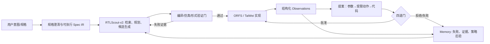
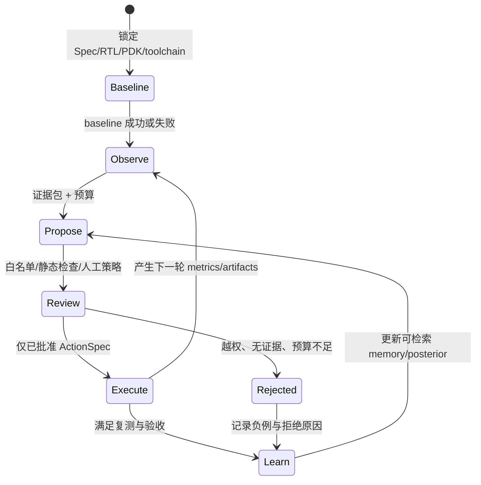
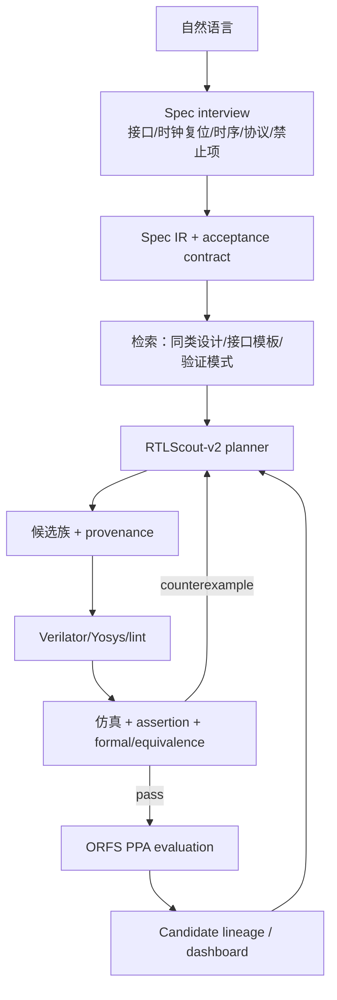
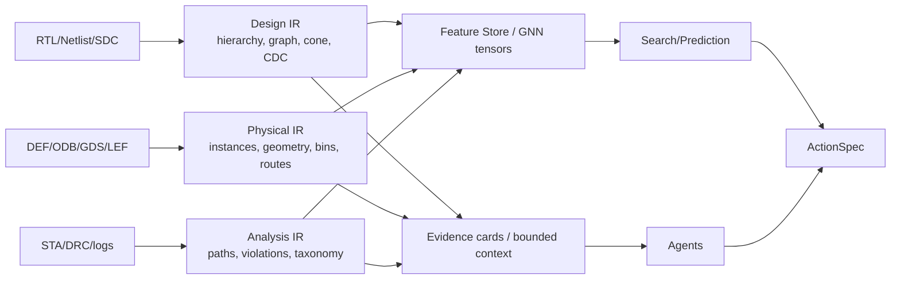

# OpenROAD 自演化 EDA 平台 v1.0 审计与 v2.0 升级规划（待审批）

审计日期：2026-08-23。范围为代码、版本化数据库、已固定的第三方插件和公开资料调研；本文件不代表已实施 v2.0 功能。

## 结论先行

v1.0 已经具备可信的 **Runtime + 插件 + 证据留存** 底座，适合作为 v2.0 的执行平面；它还不是能对任意规格持续学习、优化、并证明因果收益的研究平台。最重要的转向是：

1. 删除“默认 LLM 直接写 RTL 即完成”的产品主线，改为 **RTLScout 改造后的 Spec-to-Verified-RTL 前端唯一入口**；
2. 将“自演化”从参数相关性、文件化 ledger、空 lessons/skills，升级为具有证据、反事实比较、版本化 memory 和晋级门的四门闭环；
3. 将 ORFS/TaiWei/DPLEvolve 的结果统一成面向 Agent 的设计状态图（design state graph），而不是让 Agent 阅读散乱日志；
4. 将网站从 demo 展示转为可回放的研究工作台：候选谱系、证据、决策、执行、QoR/成本和失败原因都可见，但不展示或伪造模型的隐式思维链。

## 1. v1.0 事实审计

### 已证实的可复用资产

| 范畴 | 证据与结论 |
|---|---|
| 执行隔离 | `WorkflowRuntime`、独立 workspace、attempt、进程组取消、产物哈希和 Runtime 状态机已在代码中存在，是 v2.0 唯一执行权威的正确基础。 |
| 2D 后端 | ORFS runner 的综合至 finish 产物门禁、失败保留和 GDS 恢复语义合理；`runtime.db` 有 78 次运行（62 succeeded / 13 failed / 3 cancelled）、1044 产物、577 指标。它证明平台执行过真实任务，不自动证明算法提升。 |
| 插件边界 | ORFS、RTLScout、TaiWei、AgenticPD、DPLEvolve、EDACraft 已有 manifest/adapter 雏形。新 Runtime 已能运行插件，但旧 `scheduler/worker.py` 仍直接依赖 `ORFSRunner`，属于尚未清掉的双路径。 |
| 观测/优化 | 8 个 study、132 条参数观测；61 条 learning observation 已通过证据入库，7 条被拒绝。当前 GP/BO 是参数响应面，不能解释网表结构、不能跨设计迁移。 |
| 前端 | 上传、示例、Spec 对话、运行、产物、agent trace 和布局 PNG 已可走 API。但呈现仍以静态 SVG/PNG 与长 JSON 为主，未达到工程 GUI 或科研可复盘工作台水平。 |

### 必须如实降级的声明

* “自然语言生成 RTL”目前是服务器模型生成、人工审批的 Spec-to-RTL 路径；RTLScout adapter 的输入仍是 `benchmark`，要求上游 `run_benchmark.py`，不是任意用户 Spec 的统一入口。
* `CoderAgent.propose_edit()` 只是计划接口；DPLEvolve 插件当前只做只读 source-lock/release gate 审计，尚未生成、编译、回归任何 OpenROAD 候选代码。
* `LessonsStore`/`SkillsStore` 单元测试存在，但真实 lessons/skills 为空；行为克隆是离线 shadow policy，不能驱动生产实验。
* 静态归因是参数与 QoR 的 Pearson 类相关性，不能视为网表 cone、时序路径、拥塞热点或工具源码的因果归因。

### 质量与耦合问题（按优先级）

| 级别 | 发现 | 风险 | v2.0 处理 |
|---|---|---|---|
| P0 | `apps/api/app.py` 约 134 KB、`apps/web/assets/app.js` 约 129 KB，API 同时负责 composition、HTTP、授权、提交、agent、数据投影；前端同样混合路由、请求、渲染和领域决策。 | 改一条业务会触碰不相关页面；难以测状态机与权限。 | 拆为 application use-cases、read-model、HTTP adapter；前端按 feature slices 拆分，API schema 生成类型。 |
| P0 | 重型 TaiWei E2E 被默认 pytest 路径触发，审计时两个并发实例实际抢占 OpenROAD；测试隔离不足。 | CI 不稳定、污染机器、难复现。 | 分为 `unit`、`contract`、`integration`、`nightly-real-eda` 标记；真 EDA 串行、资源锁、独立 DB/工具链。 |
| P1 | `DesignService` 内含示例 RTL、文件存储、Yosys、网表分析、SVG；可视化也把 Verilog regex 解析、门符号和排版混在一起。 | 产品数据模型与渲染模型耦合，无法支持 hierarchy/多文件/真实 cell library。 | Design Repository、Elaboration service、Netlist IR、Schematic projection 四层分离。 |
| P1 | 旧 JobStore 与 RuntimeStore、legacy projection 并存；worker 直接构造 ORFSRunner。 | 可能产生两套任务语义和状态权威。 | 完成旧队列迁移，禁止领域模块直接启动 EDA，CI 加架构依赖测试。 |
| P1 | 迭代状态以 JSONL ledger、memory 多处写入；agent trace 仅展示，未与 observation/candidate 建关系。 | 失败无法形成可查询的学习样本，恢复语义脆弱。 | 用 append-only Experiment Graph / event store，所有节点由 ID 关联。 |
| P2 | API 中仍有本机路径和内部无认证模式；公开知识元数据把“paper lead”和已验证事实同库存放。 | 多用户/外部部署泄露和认知污染。 | artifact capability URL、租户隔离、事实/假设/引用/本地测量四种证据类型强制区分。 |

本次回归：在正确 PYTHONPATH 下执行 `pytest -q -x`，137 passed 后失败。失败原因是 `tests/test_p17_web_platform.py` 严格期望 5 个主标签，而页面新增 `Tutorial` 成为第 6 个标签，是 UI 变更未同步契约测试；其余真 TaiWei E2E 不应与普通回归混跑，已停止由本审计启动的实例。

## 2. 统一的 v2.0 四道门和工作流

四道门不是四个 Agent，而是不可绕过的状态转换：Observation、Proposal、Execution、Learning。任何模型输出只能进入 Proposal，不能直接改变状态、指标或源码。

默认升级阶梯（禁止跳级）：

1. **Baseline**：固定 design revision、spec/test oracle、PDK、容器/工具 commit、seed、预算，成功后才可优化；
2. **参数级**：仅 schema 内有上下界的 knobs，以多目标 constrained BO/多保真策略探索；
3. **受限小动作**：每个 action 具备“假设、所依证据、动作、预期、停止条件、回滚、白名单”；可包括约束/flow 配置/RTLScout 候选选择，禁止任意 shell；
4. **代码级**：停滞 N 轮且诊断定位到工具阶段后，才进入 DPLEvolve 分支；隔离编译、patch surface、差分回归、合法性与复测后人工晋级。

统一验收分数应由硬约束加 Pareto 排序构成：

`hard = functional_pass ∧ synthesis_pass ∧ impl_valid ∧ DRC≤阈值 ∧ timeout=false ∧ action_authorized`

在 hard=true 的候选中，以 `(PPA, wall time, compute cost, evidence completeness, reproducibility)` Pareto 前沿及预先登记的 scalar utility 排名；“显著优化”必须报告多 seed/重复运行、相对 baseline、置信区间和失败率，而非单次最好值。

## 3. 项目一：RTL 生成改造（RTLScout-v2，唯一入口）

### 现状与问题

现在 Spec-to-RTL 与 RTLScout 是两条并列业务线：前者方便演示，后者是 benchmark 驱动的黑箱优化器。该结构既无法让 RTLScout 获得用户规格、测试、后端 PPA 反馈，也不能证明复杂设计正确性。将“直接 LLM RTL”保留为一个候选生成器可以，但不能作为产品入口或成功判定。

### 可借鉴参考

| 参考 | 可借鉴点 | v2.0 落点 |
|---|---|---|
| [VerilogEval（ICCAD 2023）](https://doi.org/10.1109/ICCAD57390.2023.10323812) | 以可执行 testbench/pass@k 评估 RTL，而非代码看起来合理。 | 建立 task suite：spec、接口、testbench、assertion、覆盖率、限制与 PPA budget；首批覆盖 gcd、ibex 子集、UART、FIFO、AES/ethmac 的可运行配置。 |
| [Benchmarking LLMs for Automated Verilog RTL Generation（DATE 2023）](https://doi.org/10.23919/DATE56975.2023.10137086) | 强调语法、功能、硬件安全与评测基准的差别。 | 生成前先结构化需求，生成后 lint/compile/sim/formal 四类 gate，保存失败反例。 |
| [RTLScout](https://github.com/huawei-csl/rtlscout) | agentic RTL optimization、内部 correctness/cost gate、候选迭代。 | 改造 adapter contract：输入由 `benchmark` 扩展为 `SpecIR + DesignPackage + VerificationOracle + QoRObjective`；上游 benchmark 仅是 suite 中一种 package。 |
| [OpenROAD-flow-scripts](https://github.com/The-OpenROAD-Project/OpenROAD-flow-scripts) | 标准 RTL-to-GDS、设计/平台/约束基线。 | 让 RTL 候选在功能通过后进入同一 ORFS baseline/candidate protocol，不让综合数字混入前端正确性分数。 |

### 目标架构与阶段计划

* R1（先实施）：定义 `SpecIR v1`、`DesignPackage v1`、`VerificationOracle v1`、`RTLCandidate v1`；把当前 spec provider 改为“澄清+SpecIR”而非“直接登记 RTL”，RTLScout wrapper 成为唯一 `/frontend/compile` use case。
* R2：以 planner → generator(s) → verifier → critic → selector 的显式状态机替换隐式 prompt loop；支持多文件 RTL、模块层次、时钟/复位域、参数、SVA/测试和用户确认的 assumption。
* R3：形成验证金字塔：parser/lint → compile → simulation/coverage → property/formal/equivalence；失败反例进入下一轮 prompt，所有通过条件可复放。
* R4：仅将功能通过的 top-k 输送 ORFS；建立“功能正确 + PPA”的候选谱系，展示候选差异、失败门、QoR delta、运行成本和可下载 artifact。
* R5：按难度发布基准：微单元 → 控制器/数据通路 → ORFS 常见 IP（gcd、ibex、aes/ethmac）；“任意设计”只能表述为开放规格输入能力，不能承诺任意规模均能一次成功。

验收：每个公布 task 至少有冻结 oracle；功能 pass 与 PPA pass 分开报告；对保留候选在相同 PDK/toolchain/seed 下复测；对 ibex 等多文件设计先声明所支持的配置和约束。

## 4. 项目二：Agent 架构升级

现有 Optimizer/Disruptor/Coder 的角色划分是合理起点，但 Optimizer 的归因只有参数相关、Coder 不执行、Trace 没有参与 learning。不要再增加“会聊天的 agent”，应增加可验证的职责和状态边界。

借鉴 [AgenticPD](https://github.com/Cheatnut/AgenticPD) 的 trial/stage/checkpoint/decision trace 与调度思想，但平台 Runtime 保持唯一状态权威；借鉴 [OpenROAD AutoTuner](https://github.com/The-OpenROAD-Project/OpenROAD-flow-scripts/tree/master/tools/AutoTuner) 的显式 search-space/trial 语义，而不是由 prompt 自由调参。

| v2 角色 | 输入 | 只能输出 | 禁止 |
|---|---|---|---|
| Orchestrator | Experiment Graph、预算、阶段策略 | 下一受限 `ActionSpec` | 启动 subprocess/改状态 |
| Evidence/DX Agent | normalized observations、日志片段、网表/版图特征 | diagnosis + evidence pointers + 不确定度 | 把推测写为事实 |
| Search Agent | 参数 schema、posterior、constraints | 参数 proposal | 越界/绕过 baseline |
| Repair Agent | stage failure taxonomy、白名单 | 可复现 repair action | 任意 shell/文件写 |
| RTL Agent | SpecIR、oracle、retrieval pack | RTLCandidate | 声称自身正确 |
| Tool-Evolve Agent | DPLEvolve evidence packet、patch surface | patch proposal | 直接合入/发布 |
| Judge/Policy | 验收规则、独立观测 | promote/reject | 生成候选 |

新增 `Experiment Graph`：`DesignRevision → Baseline → Observation → Diagnosis → Proposal → Review → Attempt → Measurement → Decision → MemoryItem`。每条边都带主体、工具/模型版本、输入哈希、时间、预算和证据指针。Dashboard 展示的是该图、工具调用和摘要理由；不记录或展示不可审计的 chain-of-thought。

## 5. 项目三：从浅记忆到自演化

### 为什么当前“演化”常失败

1. 61 条 observation 不等于训练数据：样本主要是少数设计/参数，缺少反事实、重复、设计特征和跨设计划分；
2. lessons/skills 实际为空，且当前只有“改善时提炼”，造成幸存者偏差，失败/拒绝没有成为可检索的 anti-pattern；
3. Pearson 参数相关在小样本、强约束和多阶段 flow 中不是因果归因；
4. 没有 campaign-level baseline lock、资源预算、停滞诊断、promotion/replay 的完整闭环；
5. 模型生成的文字建议与最终 QoR、patch/RTL diff、工具版本尚未统一关联。

### 计划

建立四层 memory，而不是一个 RAG 文档库：

* **Episodic**：不可变尝试、失败、日志、counterexample、成本；
* **Semantic**：人工/规则验证过的 mechanism card，带适用域、反例、证据等级和失效条件；
* **Procedural**：受限 action template、参数 schema、repair playbook、验证步骤；
* **Statistical**：按 `design-feature × platform × stage × objective` 的 posterior/策略价值，明确 OOD 与置信度。

学习晋级要求：同一上下文重放成功；至少一个独立 seed/attempt；硬约束不回退；证据完整；仅在适用域检索。负例、拒绝动作和“无改善”也要写入，但标签为 `negative`/`rejected`，绝不伪装成 skill。

可借鉴 DPLEvolve 的证据优先设计：其私有缓存中已有 case feature→mechanism route、evidence policy、metric contract、teacher/student workflow、patch surface、RunDB 和 knowledge cards。应借鉴其 **知识契约和准入方式**，而不是把 detailed-placement 的特定机制照搬到 RTL 或全流程。

## 6. 项目四：面向 Agent 的 EDA 数据接口

EDA 原始数据（DEF/GDS/ODB、网表、时序/拥塞报告、Tcl log）不应整块塞入 LLM。v2.0 采用双通道：机器学习数值/图数据与 agent 可读的证据卡同步生成，二者都回指同一 artifact hash。

建议接口：`DesignIR`（RTL hierarchy/AST、cell/net graph、critical cones）；`PhysicalIR`（DEF/ODB 主数据，实例坐标、density/congestion bins、macro/pin/net 摘要）；`TimingIR`（端点/路径摘要而非全报告）；`RunObservation`（stage、metric、unit、parser 版本、artifact/hash、quality flag）；`ActionSpec`（白名单、precondition、rollback、budget）。格式以 protobuf/Arrow/Parquet 用于批处理、JSON Schema 用于 API、duckdb/feature store 用于查询；文本卡只存经范围裁剪的摘要和证据 locator。

参考：[CircuitNet](https://github.com/circuitnet/CircuitNet) 的布局/布线 ML 数据组织、[OpenABC-D](https://github.com/NYU-MLDA/OpenABC) 的合成图学习数据、[DRiLLS](https://arxiv.org/abs/1911.04021) 的综合动作序列。它们应作为数据模型和基准来源；导入完整数据前必须逐文件做许可证、版本、PDK 和 split 审计。

## 7. 项目五：TaiWei Pin-3D 审计与计划

事实：TaiWei adapter 明确支持 `asap7_3D`、`nangate45_3D`、`asap7_nangate45_3D` 三个固定 profile，并能对非官方模块生成隔离 case；这不是“任意工艺”。其上游基线固定在 ORFS-Research/OpenROAD 版本，而平台 2D ORFS 使用不同版本，不能直接比较 PPA。仓库记录 20 次 TaiWei run（11 成功、8 失败、1 取消，按 run 统计），但成功范围、设计和平台需要在报告中逐个给出证据 ID，不能由总数替代。

主要问题：

* PDK/technology adapter 没有能力模型（LEF/tech LEF、liberty、RC、via、3D stack、规则、工具兼容性、signoff 边界）；
* 3D 图像的 Z 是 GDS 层序可视化，不是工艺厚度/热/IR 的真实 3D signoff；
* 2D 与 3D 的不同工具锚点使“改善百分比”没有同基线意义；
* 真 E2E 过重且默认测试路径可并发运行，必须资源隔离。

计划：建立 `TechnologyProfile`/compatibility matrix；先对三个官方 profile 做同版本 pinned baseline/candidate matrix，再开放新工艺接入。新工艺的准入顺序为静态 lint → 单层 2D smoke → 双 tier via/stream-out → DRC/STA/抽取能力声明 → benchmark matrix。界面改为 2D/3D 工艺与工具版本可比性告警，而非一个“生成 3D”按钮。

## 8. 项目六：知识库与 DPLEvolve

平台现有公开库：`public-knowledge.db` 中 10 sources、5 claims、12 benchmarks；其中多项是 metadata-only，嵌入版本还标为 `disabled-bm25-only-1`。它适合展示出处，不足以作为主动规划知识。平台 lessons/skills 数据库机制就绪但没有真实条目。

本机已可访问的 DPLEvolve（私有 repo、固定 commit `96d8c613…`）含：

* 28 个 `skill_cards`、5 个 mechanism-stack cards；
* route mapping、evidence policy、metric/cross-case/teacher-child contracts；
* patch surface、source lock、baseline/full-flow/replay scripts；
* RunDB、observation、knowledge-card、family posterior 的运行时 memory 设计；
* 16+ 个问题定义，覆盖 gcd、ibex、aes、jpeg、ethmac、ariane 等设计/平台组合。

接入提案：建立只读 `KnowledgeImport` pipeline，保留来源、commit、许可证、粒度、适用阶段和人工审阅状态；先导入通用的 evidence/metric/experiment/patch-contract 卡，再由领域负责人筛选 DPL 专属卡。不得将私有内容直接混入 public corpus、不得让自动学习改写已审阅 knowledge。

## 9. 项目七：专业化 GUI 与可视化

电路图现状是对门级 Verilog 的 regex/汇总 SVG：只画 AND/OR/XOR 等少数符号、把同型 cell 聚合成数量卡，无法代表真实 connectivity、hierarchy、寄存器/时钟和标准单元。因此“门级符号不对”是数据模型不够，不只是换图标。

规划：

* **模块级**：由 elaborated hierarchy graph 生成，可展开模块、端口、总线、时钟/复位域、实例连接；
* **门级**：由 Yosys JSON 或 Verilog netlist parser + liberty cell map 生成；真实 net/port 连线、标准单元符号、扇入/扇出、搜索、cone 聚焦和层次折叠；
* **版图**：默认提供 KLayout 的只读交互 viewer（GDS/OASIS/DEF/LEF，layer palette、hierarchy、fit/search/measure、截图）；PNG 只作为预览/缩略图。OpenROAD GUI 只能以受控的桌面/远程会话方式打开同一 artifact，不能由浏览器直接执行本机 `openroad -gui`；
* 所有 view 都显示 artifact hash、tool version、top cell 和 rendering provenance，避免截图被误作 signoff。

## 10. 里程碑、论文口径与验收

| 阶段 | 交付 | 主要验收 |
|---|---|---|
| V2-A 架构加固 | Bounded contexts、Experiment Graph、测试分层、旧队列迁移计划 | API/worker/agent 无反向依赖；unit/contract 不启动 EDA；全记录可回放。 |
| V2-B RTLScout-v2 | SpecIR、verification package、候选谱系、ORFS feedback | 首批 task suite 在冻结 oracle 上可复测；功能与 PPA 分层报表。 |
| V2-C 数据与学习 | IR/feature/evidence schema、memory promotion、OOD/负例 | 同设计复现、跨设计 holdout、消融（无记忆/无诊断）对照。 |
| V2-D 四门优化 | 参数→受限动作→代码晋级、Policy/Judge | 无越权 action；停滞换向可解释；每次 promotion 有硬约束和复测。 |
| V2-E 3D/GUI | TechnologyProfile、3D matrix、交互 schematic/layout viewer | 工艺能力明确；同锚点比较；可视化忠实于 artifact。 |

论文实验最低要求：预注册 baseline、相同 PDK/toolchain/约束、设计级 train/test 切分、每类至少报告成功率/失败分类/运行成本/效益及置信区间；对学习模块做 memory、RAG、diagnosis、disruptor、code-evolve 的消融；将“工具能跑”与“算法显著提升”分开写。

## 参考项目与论文（本轮检索/核验）

* Liu et al., [VerilogEval, ICCAD 2023](https://doi.org/10.1109/ICCAD57390.2023.10323812)
* Thakur et al., [Benchmarking Large Language Models for Automated Verilog RTL Code Generation, DATE 2023](https://doi.org/10.23919/DATE56975.2023.10137086)
* [RTLScout source](https://github.com/huawei-csl/rtlscout)（平台固定 adapter commit `87a00edf…`）
* [OpenROAD](https://github.com/The-OpenROAD-Project/OpenROAD) 与 [ORFS](https://github.com/The-OpenROAD-Project/OpenROAD-flow-scripts)
* [OpenROAD AutoTuner](https://github.com/The-OpenROAD-Project/OpenROAD-flow-scripts/tree/master/tools/AutoTuner)
* [AgenticPD](https://github.com/Cheatnut/AgenticPD)（截至审计日仍未见 LICENSE，参考架构但不复制/再分发）
* [CircuitNet](https://github.com/circuitnet/CircuitNet)、[OpenABC-D](https://github.com/NYU-MLDA/OpenABC)
* Mirhoseini et al./相关开源路线之外的可复现基准应分开审计；[DRiLLS](https://arxiv.org/abs/1911.04021) 用于综合 RL 动作建模参考
* [TaiWei Pin-3D](https://github.com/CODA-Team/TaiWei-Pin-3D)
* 私有 [DPLEvolve](https://github.com/CODA-Team/DPLEvolve)，本机固定源码可读，使用须遵守其 BSD-3-Clause 与内部访问边界。

## 审批点

在编码前需要确认：RTLScout-v2 的首批任务范围和验证资源（仿真/形式验证许可）、优先支持的 PDK/工艺矩阵、是否允许 DPLEvolve 仅以受控 patch surface 进入 V2-D、论文的主目标（Spec-to-RTL、全流程 QoR、自演化、还是 3D）及可接受计算预算。

## 文档归档建议（本轮未删除）

`plan/` 现有汇报、施工提示、数据说明、外部项目报告、图片和演示材料混放；`docs/evidence/` 另有大量验收证据。建议 v2.0 启动时执行一次**可逆归档**：

* 保留为权威当前文档：`docs/architecture.md`、`docs/DATA_MODEL.md`、`docs/ROADMAP.md`、本规划，以及版本化 `docs/evidence/`；
* 将历史计划/报告移动到 `docs/archive/v1.0/`，建立 `INDEX.md`，记录原路径、日期、状态（历史/已实现/被替代）和替代文档；
* `plan/平台功能声明-供审计.md` 与 `deliverables/平台功能声明-供审计.md` 等同主题文件应先做内容 hash/差异比较，再保留一个 canonical source 和一个指向它的说明；
* 仅在 index、Git 历史和用户确认后删除确定重复且无独特附件的副本；不得删除原始论文、PPT、PDF、实验原始数据或任何 `var/` 运行证据。
