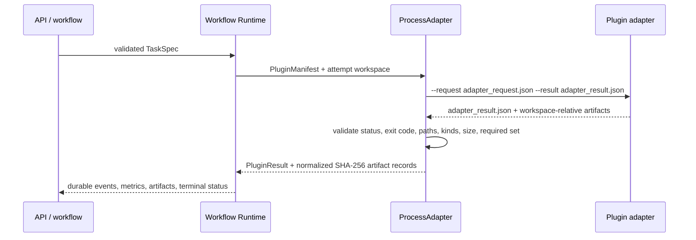

# Plugin authoring guide

OpenROAD Platform plugins are versioned subprocess adapters. The Workflow
Runtime validates the task and manifest, creates an attempt workspace, launches
the adapter with a bounded environment, and independently validates its result
and artifacts. A plugin cannot grant itself success by printing a message.

## Contract flow



The authoritative contract classes live in
`packages/contracts/src/openroad_platform_contracts/platform.py`. The process
boundary is implemented in
`packages/execution/src/openroad_platform_execution/adapter.py`.

## 1. Define a manifest

A `PluginManifest` declares:

- `plugin_id` and `plugin_version`;
- `adapter_entry`, a non-empty executable argv prefix;
- capabilities and supported machine architectures;
- JSON input/output schema descriptors;
- required host tools and the maximum adapter timeout;
- an explicit environment mapping;
- allowed artifact kinds, with `required: true` for mandatory kinds.

Example:

```python
from openroad_platform_contracts import PluginManifest

manifest = PluginManifest(
    plugin_id="example-analyzer",
    plugin_version="1.0.0",
    adapter_entry=("python3", "/absolute/pinned/example_adapter.py"),
    capabilities=("eda.analysis.example",),
    supported_arch=("aarch64",),
    input_schema={"type": "object"},
    output_schema={"type": "object"},
    required_tools=("python3",),
    default_timeout_seconds=300,
    artifact_rules=(
        {"kind": "report", "required": True},
        {"kind": "log", "required": False},
    ),
    environment={"EXAMPLE_PROFILE": "pinned-v1"},
)
manifest.validate()
```

Do not copy the complete host environment into a manifest. `ProcessAdapter`
starts with a short safe-host allowlist and then adds the manifest environment.
Never place credentials in this mapping.

## 2. Build a TaskSpec

The application-facing builder converts reviewed user input into an immutable,
bounded `TaskSpec`. It should:

- validate identifiers and allowlist every input/parameter;
- record file size and SHA-256 for source references;
- use a finite timeout and retry budget;
- list the artifact kinds required by the task;
- store ownership, provenance, and workflow linkage as non-secret labels.

```python
from openroad_platform_contracts import TaskSpec

task = TaskSpec(
    task_id="example-01",
    project_id="openroad-platform",
    design_id="design-01",
    plugin_id="example-analyzer",
    inputs={"source": {"path": "/bounded/input.v", "sha256": "..."}},
    parameters={"mode": "summary"},
    timeout_seconds=300,
    max_attempts=1,
    expected_artifacts=("report",),
    labels={"source": "reviewed-web-submit"},
)
task.validate()
```

The adapter should re-check referenced file size/hash before use. A hash stored
only at submission time is not sufficient if the referenced file is mutable.

## 3. Implement the adapter protocol

The Runtime invokes the adapter with:

```text
example_adapter.py --request <attempt>/adapter_request.json \
                   --result  <attempt>/adapter_result.json
```

The request contains `schema_version`, plugin identity, and the serialized
TaskSpec. The adapter must reject an unsupported version or identity, keep all
generated files inside the attempt workspace, and atomically write its result.

A successful result has this shape:

```json
{
  "schema_version": 1,
  "status": "succeeded",
  "exit_code": 0,
  "started_at": "2026-08-16T00:00:00+00:00",
  "ended_at": "2026-08-16T00:00:01+00:00",
  "metrics": [
    {"name": "example_count", "value": 3, "parser_id": "example-v1"}
  ],
  "artifacts": [
    {"kind": "report", "path": "results/report.json"}
  ],
  "failure": null,
  "provenance": {"tool_version": "1.0.0"}
}
```

For a failure, use a non-zero `exit_code`, `status: "failed"`, and a structured
`failure` object. The process exit code must agree with the result. Timeout and
cancellation are owned by `ProcessGuardian`; adapters should allow signals to
reach their subprocess group and should not daemonize unmanaged children.

## 4. Artifact rules

Artifact paths are relative to the attempt workspace. Runtime rejects:

- absolute paths or `..` escapes;
- missing or empty files;
- kinds absent from the manifest allowlist;
- any required manifest/task kind not returned;
- success paired with a non-zero process exit.

After validation, Runtime records the artifact's normalized relative key,
byte size, SHA-256, metadata, attempt identity, and creation time. Parsers should
identify their parser name/version and, when possible, point metrics back to a
source artifact.

## 5. Registration and integration metadata

Programmatic manifests are registered through `PluginRegistry`. Declarative
manifests can be loaded from a directory of `*.plugin.json` files. Third-party
integrations should also provide:

- an exact source commit lock;
- tool/compiler/runtime versions and binary hashes where practical;
- a license audit and redistribution boundary;
- an isolated install/environment profile;
- a capability statement that separates verified behavior from future work.

Use `integrations/examples/echo.plugin.json` and `echo_adapter.py` as the small
protocol example. Production adapters under `packages/execution/` demonstrate
stricter source staging, toolchain checks, and postprocessing.

## 6. Required tests

At minimum, cover:

1. valid manifest and task construction;
2. successful adapter result and exact artifact hashes;
3. missing/empty/escaping/unknown artifacts;
4. malformed result JSON and process/result exit mismatch;
5. timeout, cancellation, and child-process cleanup;
6. input size/hash mismatch and unsupported parameters;
7. architecture, source commit, and toolchain mismatch;
8. a real bounded smoke when the upstream tool is locally available.

Run focused tests first and the full suite before review:

```bash
python3 -m pytest -q tests/test_plugin_registry.py tests/test_process_adapter.py
python3 -m pytest -q
python3 scripts/check_tracked_secrets.py
git diff --check
```

Real-tool claims must include the command, pinned commits, Runtime DB path, run
and attempt IDs, terminal status, metrics, artifact count, and artifact hashes.

## 插件开发摘要

插件由 `PluginManifest`、有界 `TaskSpec`、独立子进程 adapter 和明确的产物规则
组成。adapter 只能在 Attempt workspace 内生成文件，不能自行决定平台最终状态；
Runtime 会再次验证退出码、JSON 协议、路径、文件大小、必需类型并计算 SHA-256。
接入第三方工具时还必须提供源码锁、环境锁、许可证审计和真实 smoke 证据，不能把
“代码存在”或“模型声称成功”当成工具运行成功。
