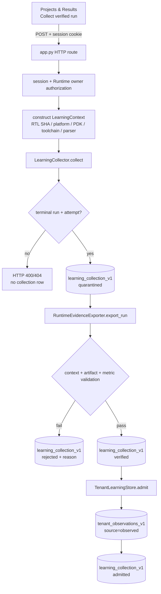

# Self-Evolution 入库问题历史报告（v1，非当前接口说明）

> 本文保留旧版手工 `collect-learning` 试验的审计证据。该产品入口已在 v2 删除；当前学习只能由唯一 BO/GP 闭环依据终态 EDA 证据自动触发。请勿照本文命令调用现行服务。

> 审计日期：2026-08-16
>
> 审计范围：`collect-learning` API、`LearningCollector`、`RuntimeEvidenceExporter`、`TenantLearningStore`，以及 `var/public/runtime.db` / `var/public/tenant-learning.db` 运行证据。
>
> 事实标记：本文所有判断均以 `[事实]` 或 `[假设]` 标注；`[假设]` 后附验证方法。

## 0. 结论先行

- [事实] 审计开始时，`var/public/tenant-learning.db` 的 `learning_collection_v1` 和 `tenant_observations_v1` 都是 0 行；数据库 SHA-256 为 `67501128246f045ce2c2ddee27003d9ac1485eea02b0e08235fb961e41b80933`。
- [事实] 同期 `var/public/runtime.db` 中有 2 条 `succeeded` ORFS run，且两条 run 都有成功 attempt、已登记 artifact 和数值 metric。Runtime 数据库 SHA-256 为 `6456a92c27e87520314f6a2e6c2048fa791a81043e79100665a20443bf73b733`。
- [事实] 对完整 `mux4` run `e56b71e066d44581a165428a54ac7f12` 的只读导出成功；随后在与原库 SHA-256 一致的隔离数据库副本上真实调用 HTTP `POST /api/runtime/runs/:id/collect-learning`，服务返回 HTTP 201 和 `status=admitted`。
- [事实] 对真实学习库执行相同的生产 Collector 后，数据库出现 1 条 `admitted` collection 和 1 条 `observed` observation；重复执行不增加行，也不改变数据库 SHA-256。
- [事实] 因而，本次没有复现 schema 不匹配、事务回滚、parser version 不匹配或异常吞掉导致的有效 run 入库失败，不需要源代码修复。历史空库的已证实根因是：没有任何请求进入 Collector 的可留痕阶段，即运行完成与学习收集之间存在“必须显式触发”的操作断点。
- [事实] “以前经常失败”的具体 HTTP 状态、请求 payload 和异常文本没有被数据库或持久日志保存，不能从现有证据反推出每一次历史失败原因。本文不会把可能原因冒充历史事实。
- [假设] 一部分历史失败可能发生在 Collector 写 `quarantined` 之前，例如未登录、run 所有权不匹配、run 非终态、没有 attempt、非法 tenant/project 或缺少 RTL SHA-256；验证方法是按第 6 节增加失败审计，再用同一账号和同一 run 重放请求。

## 1. Tutorial：如何完成一次入库

### 1.1 前置条件

- [事实] API 必须使用已登录 session；未登录的 POST 在 `apps/api/app.py:1905-1915` 返回 401。
- [事实] session 用户必须与 Runtime `task_spec.labels.owner_id` 一致；授权发生在 `apps/api/app.py:333-338` 和 `apps/api/app.py:964-968`。
- [事实] run 必须是终态 `succeeded`、`failed`、`cancelled` 或 `timed_out`，并至少有一个 execution attempt；检查位于 `packages/analysis/src/openroad_platform_analysis/learning_collector.py:131-143`。
- [事实] Runtime TaskSpec 必须保存不可变 RTL SHA-256；API 在 `apps/api/app.py:969-972` 提取并检查它。
- [事实] `succeeded` observation 必须至少包含一个数值 metric；契约检查位于 `packages/contracts/src/openroad_platform_contracts/learning.py:155-182`。Exporter 还会校验 design、RTL fingerprint、platform 和已登记 QoR artifact，见 `packages/analysis/src/openroad_platform_analysis/learning_data.py:41-81`。

### 1.2 启动 API

[事实] 使用任务书中的 public state 配置时，API 与 Runtime 指向同一状态目录，因此学习库为 `var/public/tenant-learning.db`：

```bash
cd /share/home/yuanwenjie/openroad-platform
export PYTHONPATH="packages/contracts/src:packages/execution/src:packages/scheduler/src:packages/analysis/src:packages/visualization/src"

python3 apps/api/app.py \
  --host 127.0.0.1 --port 8000 \
  --db var/public/platform.db \
  --runtime-db var/public/runtime.db \
  --campaign-db var/public/campaign.db \
  --optimization-db var/public/optimization.db \
  --auth-db var/public/web-auth.db \
  --orfs-root ../OpenROAD-flow-scripts
```

[事实] 健康检查只证明 API 可访问和工具链状态，不代表已有 observation：

```bash
curl -fsS http://127.0.0.1:8000/api/health
```

### 1.3 推荐方式：从网页显式收集

1. [事实] 登录平台，打开 **Projects & Results**。
2. [事实] 选择一条 `runtime_run` 且状态为 `succeeded` 的结果；前端只对这类记录显示收集按钮，条件位于 `apps/web/assets/app.js:1271-1276`。
3. [事实] 点击 **Collect verified run / 收集验证结果**。前端发送 `project_id`、`pdk_id` 和 `metric_parser_version=web-evidence-v1`，见 `apps/web/assets/app.js:1284-1298`。
4. [事实] 只有响应中的 `status` 为 `admitted`，才表示 observation 已入库；`rejected` 表示请求到达 Collector，但证据校验或 admit 失败。
5. [事实] 再按第 1.5 节查询数据库，不能只依据页面提示判断成功。

### 1.4 API 方式：可复现请求

[事实] 先登录并将 session cookie 保存到临时文件。以下占位符必须换成真实账号信息，文档不保存密码：

```bash
curl -fsS -c /tmp/orp-learning-cookie.txt \
  -H 'Content-Type: application/json' \
  -d '{"username":"<username>","password":"<password>"}' \
  http://127.0.0.1:8000/api/auth/login
```

[事实] 查询当前账号可见的 Runtime runs，并选一条终态 run：

```bash
curl -fsS -b /tmp/orp-learning-cookie.txt \
  http://127.0.0.1:8000/api/runtime/runs
```

[事实] 发起收集；`project_id` 应与 TaskSpec 的 project 一致，`pdk_id` 应描述本次运行的平台/PDK：

```bash
curl -fsS -b /tmp/orp-learning-cookie.txt \
  -H 'Content-Type: application/json' \
  -d '{
    "project_id":"openroad-platform",
    "pdk_id":"nangate45",
    "metric_parser_version":"web-evidence-v1"
  }' \
  http://127.0.0.1:8000/api/runtime/runs/<run_id>/collect-learning
```

[事实] 成功响应必须同时包含 `status: "admitted"`、非空 `observation_id` 和 `reason: null`。本次真实响应的关键字段为：

```json
{
  "collection_id": "collect-80a53fddc63c86a291d00d60",
  "run_id": "e56b71e066d44581a165428a54ac7f12",
  "attempt_id": "1990a8bbedf0419e8867ecd2be47058a",
  "parser_version": "web-evidence-v1",
  "status": "admitted",
  "observation_id": "observation-53acab86527b7fd4e809de1f",
  "reason": null
}
```

### 1.5 用数据库证据验收

[事实] 下面的只读查询同时检查 collection 状态和 observation 内容：

```bash
sqlite3 -readonly -header -column var/public/tenant-learning.db \
  "SELECT collection_id,status,run_id,attempt_id,observation_id,reason
     FROM learning_collection_v1;
   SELECT tenant_id,project_id,observation_id,fingerprint,opt_in_shared,tombstoned
     FROM tenant_observations_v1;"
```

[事实] 本次验收结果为 `collections=1`、`observations=1`。Observation 来源为 `observed`，状态为 `succeeded`，包含 19 个 evidence pointer 和如下 QoR：

| 字段 | 实测值 |
|---|---:|
| `area_um2` | `87.248` |
| `setup_wns_ns` | `5.7613` |
| `wirelength_um` | `292.0` |
| `power_W` | `5.832e-06` |
| `drc_errors` | `0.0` |
| `runtime_seconds` | `82.054` |

[事实] 当前真实学习库 SHA-256 为 `17bdf5e2a68f24bd08e564c731c720658db2a86dc4ac9680d318a74248773ed5`；Runtime 数据库仍为 `6456a92c27e87520314f6a2e6c2048fa791a81043e79100665a20443bf73b733`，证明收集没有修改 Runtime 原始证据。

### 1.6 幂等性验证

[事实] 相同 tenant、project、run、attempt、context 和 parser version 会得到相同 `collection_id`。第二次执行返回同一 receipt，数据库仍是 1/1，学习库 SHA-256 在调用前后均为：

```text
17bdf5e2a68f24bd08e564c731c720658db2a86dc4ac9680d318a74248773ed5
```

[事实] 幂等键的构造和终态短路位于 `packages/analysis/src/openroad_platform_analysis/learning_collector.py:144-150`；数据库唯一约束位于同文件 `:58-67`。

## 2. 问题现象

### 2.1 审计前空库

[事实] 审计开始时执行：

```sql
SELECT 'learning_collection_v1', COUNT(*) FROM learning_collection_v1
UNION ALL
SELECT 'tenant_observations_v1', COUNT(*) FROM tenant_observations_v1;
```

[事实] 结果为：

```text
learning_collection_v1  0
tenant_observations_v1  0
```

[事实] 空的不只是 observation 表，连用于保存 `quarantined / verified / admitted / rejected` 状态的 collection 表也为空。

### 2.2 可用 Runtime 证据并不为空

[事实] `var/public/runtime.db` 有两条成功 run：

| run_id | design | target stage | attempt | artifacts | metrics |
|---|---|---|---|---:|---:|
| `e225323a8379421aac24f5aa6fff277c` | `teacher_counter` | `synth` | `88538b161bc54721b52517ee51dff09a` | 9 | 7 |
| `e56b71e066d44581a165428a54ac7f12` | `mux4` | `finish` | `1990a8bbedf0419e8867ecd2be47058a` | 18 | 7 |

[事实] 两条 run 的 QoR report 都存在，文件尺寸和 SHA-256 与 Runtime artifact 登记一致：

| run | report SHA-256 |
|---|---|
| `teacher_counter` | `ec97d463699c25db1838a12a8bba2911a1a0dab27b6aafffe4c7fe04995f02dc` |
| `mux4` | `afe0607c3dfd678eb1351b72e985ead46d55ff882a0a1ba5dfdb5a66875f99f2` |

### 2.3 “空库”和“反复入库失败”不是同一个事实

- [事实] Collector 在完成 tenant/context/run/attempt 前置检查后，第一笔动作就是写 `quarantined`，见 `learning_collector.py:131-152`。
- [事实] Exporter 或 `TenantLearningStore.admit()` 在此之后抛出的异常会被捕获，并写成带 `reason` 的 `rejected` collection，见 `learning_collector.py:153-164`。
- [事实] 因而，审计前 collection 表为 0 可以排除“请求已经通过前置检查、但 Exporter/admit 反复失败”这一说法。
- [事实] collection 表为 0 不能排除 HTTP 401/404、缺 RTL SHA、非法 scope、非终态或无 attempt 等发生在首次 `_record()` 之前的失败。
- [事实] 现有数据库不保存这些前置失败；仓库中也没有对应历史 HTTP 响应日志，因此不能诚实地给出每次历史失败的比例或精确原因。

## 3. 调用链分析

### 3.1 数据流图



### 3.2 每层职责和前置条件

| 层 | 代码位置 | [事实] 职责 | [事实] 失败是否留 collection 行 |
|---|---|---|---|
| 前端 | `apps/web/assets/app.js:1271-1298` | 仅对 succeeded Runtime result 显示按钮并 POST | 否；请求尚未到后端 |
| HTTP 路由 | `apps/api/app.py:1878-1921`, `:1998-2002` | 校验 session，把 session user 强制写入 payload | 401 时不留 |
| API service | `apps/api/app.py:964-996` | 授权 run，提取 RTL SHA，构造 LearningContext | 授权/RTL/context 失败时不留 |
| Collector 前置 | `learning_collector.py:131-152` | 校验 scope、context、终态和 attempt，生成幂等键 | 首次 `_record` 前失败不留 |
| Exporter | `learning_data.py:41-112` | 只读 Runtime，验证上下文/artifact，组装 observed sample | 失败留 `rejected` |
| Store | `learning_collector.py:70-88` | 校验 observation，按 tenant/project/fingerprint admit | 失败留 `rejected` |
| Receipt | `learning_collector.py:166-188` | 更新状态并读取最终 receipt | 留 `admitted` 或 `rejected` |

### 3.3 上下文如何生成

- [事实] `design_id` 与 `design_fingerprint` 来自 Runtime TaskSpec，不接受前端覆盖，见 `apps/api/app.py:969-976`。
- [事实] `platform` 来自 Runtime parameters；`pdk_id` 优先使用请求值，否则回退 platform，见 `apps/api/app.py:977-983`。
- [事实] `toolchain_id` 由 Runtime plugin id 和已登记 stage plugin version 生成，前端传入的 `toolchain_id` 不参与权威上下文，见 `apps/api/app.py:973-986`。
- [事实] `metric_parser_version` 使用请求值或 `web-evidence-v1`，并经过 identifier 规范化，见 `apps/api/app.py:988-990` 和 `:1661-1663`。
- [事实] parser version 是幂等上下文的一部分，而不是要求与 Runtime metric 表中的 parser version 字符串完全相同；本次 `web-evidence-v1` 已真实 admitted。

## 4. 根因：分类、证据与复现

### 4.1 根因分类结论

| 分类 | 结论 | 证据 |
|---|---|---|
| (a) 前置条件缺失 | [事实] 不是本次所选 `mux4` run 的原因 | run/attempt 均 succeeded；RTL SHA、owner、platform、artifact 和数值 metrics 齐全；Exporter 实测成功 |
| (b) 代码缺陷 | [事实] 没有复现导致有效 run 无法入库的 schema/事务/parser 缺陷 | 隔离 HTTP POST 和真实 Collector 均 admitted；真实库出现 observation；幂等复测通过 |
| (c) 集成/触发断点 | [事实] 是审计前 0/0 的已证实主因 | Runtime 成功不会自动调用 Collector；只能由显式 UI/API/campaign 操作触发；空 collection 表表明没有请求进入可留痕阶段 |
| (d) observed-only 门槛 | [事实] 门槛存在，但不是本次空库的阻塞原因 | `mux4` 的 succeeded attempt 有数值 QoR，成功生成 `source=observed` observation |

### 4.2 隔离 HTTP 复现

- [事实] 将 `runtime.db`、`tenant-learning.db` 和 API 依赖数据库复制到 `/tmp/openroad-phase1-repro-20260816/`；复制后的两个核心数据库 SHA-256 与原库完全一致。
- [事实] 在 `127.0.0.1:18081` 启动生产 `apps/api/app.py`，使用复制的 auth/state 数据和原 artifact 的只读绝对路径。
- [事实] 健康检查返回 HTTP 200；对 `mux4` run 的真实 POST 返回 HTTP 201、`status=admitted`、`reason=null`。
- [事实] 服务访问日志为：

```text
[web] 127.0.0.1 - "GET /api/health HTTP/1.1" 200 -
[web] 127.0.0.1 - "POST /api/runtime/runs/e56b71e066d44581a165428a54ac7f12/collect-learning HTTP/1.1" 201 -
```

- [事实] 隔离学习库随后为 1 collection + 1 observation，observation payload 为 3980 bytes，fingerprint 为 `95cd917254d07410059667ef7e0aca1862125c94a742ac673d1b0e5b2e722396`。

### 4.3 真实库复现

- [事实] 使用生产 `RuntimeStore`、`LearningCollector`、`TenantLearningStore` 对真实 `var/public/runtime.db` 中同一 run 执行收集，receipt 为 `admitted`。
- [事实] 真实 observation id 为 `observation-53acab86527b7fd4e809de1f`，context fingerprint 为 `3f99ed63c9b63198d0b7633cb3c7f11e1a8fd9b304c2a2bfd63b7ed1f6f3dcbe`。
- [事实] 写入后 `var/public/tenant-learning.db` 为 1/1，`var/public/runtime.db` SHA-256 未变化。
- [事实] 第二次相同收集返回完全相同的 receipt；调用前后学习库 SHA-256 都是 `17bdf5e2a68f24bd08e564c731c720658db2a86dc4ac9680d318a74248773ed5`。

### 4.4 对“经常失败”的诚实边界

- [事实] 当前证据能证明“历史上没有成功或 rejected collection 被持久化”，不能证明“用户从未发出过请求”。
- [事实] API 在进入 Collector 前可返回 401/404/400，这些响应不会写 `learning_collection_v1`。
- [事实] 当前访问日志不是结构化持久审计，数据库也没有 preflight failure 表；所以历史请求的账号、payload、HTTP 状态和异常文本已经不可恢复。
- [假设] 若用户确实多次看到失败，最可能属于 preflight/auth/scope 类，而不是 Exporter/admit 类；依据是后者必留 `rejected`，而前者不留。验证方法：保存 API 错误响应和 server log，再查询 collection 表是否新增 `rejected`。
- [假设] “运行成功后学习页仍为 0”也可能被误解为自动入库失败；实际上设计是显式 opt-in。验证方法：完成 run 后先查询 0，再点击一次收集按钮并查询 1。

## 5. 修复状态

### 5.1 做了什么

- [事实] 没有修改 Collector、Exporter、Store、API 或前端源代码，因为有效证据链已真实通过，缺少支持代码修复的失败证据。
- [事实] 完成了数据层的操作性恢复：将一条真实、成功、证据完整的 `mux4` Runtime run 显式收集到真实 tenant learning store。
- [事实] 恢复后数据库已有 1 条 observation，满足“真实 observation ≥ 1”的验收条件。
- [事实] 完成幂等复测，重复收集既不重复写入，也不改变学习数据库。

### 5.2 “修复了吗”的准确回答

- [事实] “学习库完全为空”这一数据状态已经修复：当前为 1 collection / 1 observation。
- [事实] 本次没有发现需要修复的有效 run 入库代码缺陷，因此不能宣称做过代码修复。
- [事实] “缺少自动触发”不是实现遗漏，而是当前 evidence-first / explicit opt-in 设计；前端说明也明确写着 `This explicit action preserves provenance`。
- [事实] “前置失败不持久留痕”仍是诊断能力缺口，尚未在阶段一修改；它不阻止有效 run 入库，但会阻止事后还原历史失败。

## 6. 遗留风险与后续建议

1. [事实] **增加 preflight 失败审计。** 在不记录密码/cookie 的前提下，持久化 request id、run id、session user id、HTTP status、失败阶段和截断后的 reason；这能让下一次“经常失败”有可核验分母和分类。
2. [事实] **前端区分 admitted/rejected。** 当前 UI 对任何正常 JSON receipt 都显示 “Verified experience collected · `<status>`”；建议 `rejected` 使用错误样式并直接展示 `reason`，避免把拒绝误读为成功。
3. [事实] **在 Runtime 成功页强化显式动作。** 明确写“Runtime succeeded 不会自动进入学习库”，并显示最近 collection 状态。
4. [事实] **增加 API 集成测试。** 现有 `tests/test_p16_learning_collector.py` 验证 Collector，但应补 HTTP 级 admitted、wrong-owner、missing-RTL、rejected 和 idempotent 用例。
5. [事实] **监控 rejected 比率。** 一旦有持久审计，按 parser version、plugin version、platform 和失败阶段聚合；在样本不足前不能声称“经常”。
6. [假设] 如果未来允许自动收集 succeeded run，需要额外的明确租户策略和 opt-in 设置；验证方法是先定义 consent 契约，再测试跨 tenant/project 隔离和撤回流程。当前不建议在没有该契约时自动 admit。

## 7. 验收证据索引

| 证据 | 路径 / 标识 | SHA-256 / 结果 |
|---|---|---|
| Runtime DB | `var/public/runtime.db` | `6456a92c27e87520314f6a2e6c2048fa791a81043e79100665a20443bf73b733`（收集前后不变） |
| Learning DB（审计前） | `var/public/tenant-learning.db` | `67501128246f045ce2c2ddee27003d9ac1485eea02b0e08235fb961e41b80933`；0/0 |
| Learning DB（审计后） | `var/public/tenant-learning.db` | `17bdf5e2a68f24bd08e564c731c720658db2a86dc4ac9680d318a74248773ed5`；1/1 |
| Runtime run | `e56b71e066d44581a165428a54ac7f12` | `succeeded` |
| Runtime attempt | `1990a8bbedf0419e8867ecd2be47058a` | `succeeded` |
| QoR report | `var/public/runtime-workspaces/e56b71e066d44581a165428a54ac7f12/46701b1388794e758677a3556fee37db/attempt-1/orfs/implementation/analysis/report.json` | `afe0607c3dfd678eb1351b72e985ead46d55ff882a0a1ba5dfdb5a66875f99f2` |
| Collection | `collect-80a53fddc63c86a291d00d60` | `admitted`, `reason=null` |
| Observation | `observation-53acab86527b7fd4e809de1f` | `source=observed`, fingerprint `95cd917254d07410059667ef7e0aca1862125c94a742ac673d1b0e5b2e722396` |
| 隔离复现目录 | `/tmp/openroad-phase1-repro-20260816/` | HTTP 201，1 collection / 1 observation |
| 自演化定向测试 | `tests/test_p16_learning_collector.py`, `tests/test_learning_data.py` | `7 passed in 0.68s` |
| 全量回归 | `tests/` | `216 passed in 98.38s`（允许本机 loopback socket 后） |

[事实] 沙箱内第一次全量测试为 `208 passed, 1 failed, 7 errors`；唯一 failure 和 7 个 errors 都在创建 `127.0.0.1` 测试 socket 时抛出 `PermissionError: [Errno 1] Operation not permitted`。允许本机 loopback 后，同一测试集为 216/216 passed，因此前一结果是执行环境限制，不是代码回归。

## 8. 最小复核命令

[事实] 以下命令不会修改数据库，可在交付验收时重新执行：

```bash
cd /share/home/yuanwenjie/openroad-platform

sha256sum var/public/runtime.db var/public/tenant-learning.db

sqlite3 -readonly -header -column var/public/tenant-learning.db \
  "SELECT collection_id,status,run_id,attempt_id,observation_id,reason
     FROM learning_collection_v1;
   SELECT tenant_id,project_id,observation_id,fingerprint
     FROM tenant_observations_v1;"

sqlite3 -readonly -header -column var/public/tenant-learning.db \
  "SELECT json_extract(payload_json,'$.source') AS source,
          json_extract(payload_json,'$.status') AS status,
          json_extract(payload_json,'$.metrics.area_um2') AS area_um2,
          json_extract(payload_json,'$.metrics.setup_wns_ns') AS setup_wns_ns,
          json_extract(payload_json,'$.metrics.drc_errors') AS drc_errors
     FROM tenant_observations_v1;"
```
