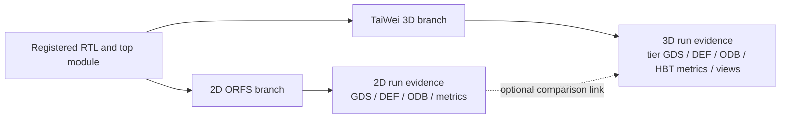

# 2D and 3D physical-design branches

The platform treats 2D OpenROAD Flow Scripts (ORFS) and TaiWei 3D as two
independent implementations of the same registered RTL. A 3D run does not
consume the output of a 2D run and a successful 2D run is not a prerequisite.

The dashed link is metadata only. When a succeeded 2D ORFS run for the same
registered design exists, the Web application may store its run ID on the 3D
task for comparison. TaiWei still starts from RTL and performs its own
synthesis, 2D floorplan and partitioning before the two-tier implementation.

## Starting a 3D run

1. Import or generate RTL so the platform has a registered design and top
   module.
2. Open **Backend Design**, select the design, and open **TaiWei 3D IC**.
3. Choose a 3D platform and review the implementation controls.
4. Select **Generate 3D**. The API records a durable Runtime task; the Runtime
   worker owns the long-running tool execution.
5. Follow the run in **Projects & Results**. A run is successful only after the
   adapter validates the tool result and registers the required artifacts.

The Web form submits the following engine-native controls:

| Web field | Engine setting | Accepted values |
| --- | --- | --- |
| 3D platform | `tech` | `asap7_3D`, `nangate45_3D`, `asap7_nangate45_3D` |
| Core utilization | `CORE_UTILIZATION` | 1-99 percent |
| Parallel cores | `NUM_CORES` | 1-256 |
| CTS layer | `CTS_LAYER` | `bottom`, `upper` |
| Outer iterations | `OUTER_ITERATIONS` | 1-16 |
| Skip internal 2D partition | `SKIP_2D_PART` | Boolean |
| Allow/split cross-tier nets | `PIN3D_ALLOW_NET_FLOW`, `PIN3D_SPLIT_NET_FLOW` | Boolean |
| ABC area mode | `ABC_AREA` | Boolean |
| Clock port and period | task RTL constraints | Port name and positive period in ns |

Skipping the internal 2D partition is an advanced resume control, not a way to
reuse an unrelated platform 2D run. A fresh run should normally leave it off.

## Case mapping

The pinned TaiWei source includes official cases such as `gcd`, `ibex`, `aes`,
`ariane133`, `bp_quad`, `jpeg`, and `swerv_wrapper`. When the registered top
module selects one of those cases, the run uses that case's pinned multi-file
RTL and constraints. For another registered module, the adapter creates an
isolated case configuration inside the attempt workspace and stages the
registered design's RTL there. It never modifies the pinned source tree. This
distinction is recorded by the task input and toolchain snapshot; an official
case validation must not be presented as execution of different uploaded RTL
that merely reused the same module name.

Support in the adapter is not itself a silicon-quality claim. Each run records
the exact source commit, ORFS/OpenROAD/Yosys identities, task parameters, and
engine environment in `toolchain_snapshot.json`. Results should be described
as verified only when the corresponding Runtime run reached `succeeded`.

## Evidence and failure semantics

A successful 3D attempt requires at least these artifact kinds:

- `three_d_eval` and `three_d_summary`
- `gds`, `def`, `odb`, and `netlist`
- `toolchain_snapshot` and adapter `log`

When available, the adapter also registers SDC/SPEF files, cross-tier reports,
2D layout renders, and 3D tier or GDS-stack views. The postprocessor streams
GDS from the routed DEF with the selected platform LEFs and verifies that
cross-tier via geometry survives stream-out. Missing required output, a
non-zero engine result, unresolved via geometry, or invalid postprocessing
causes the Runtime attempt to fail; the platform does not infer success from a
file name or a UI message.

Every attempt has its own immutable task specification and workspace. Failed
attempts are retained for diagnosis. Production workers should use the same
Runtime database and heartbeat path as the API serving that deployment; an
isolated validation worker must use an isolated Runtime database and heartbeat
to avoid another worker consuming a task with stale code.
